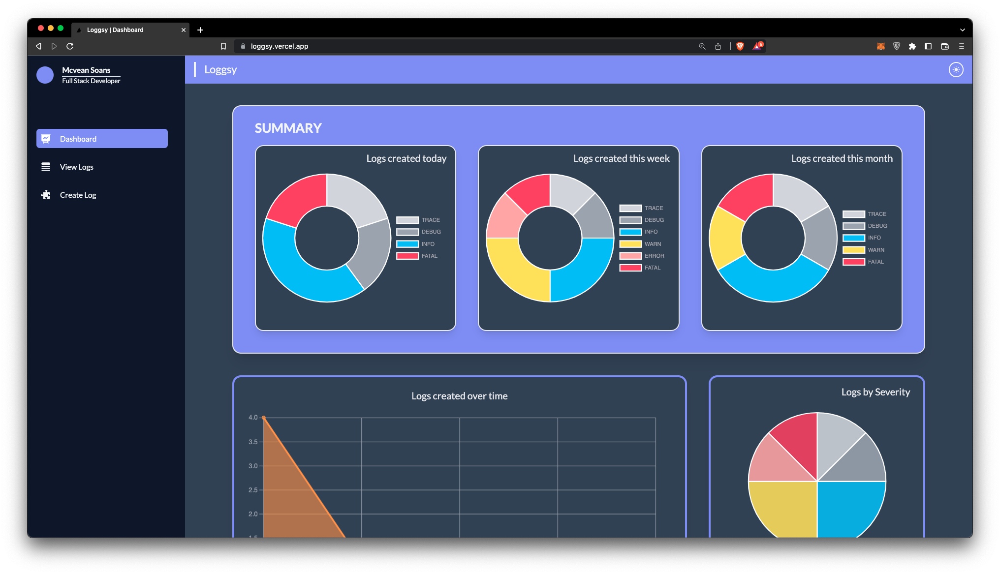
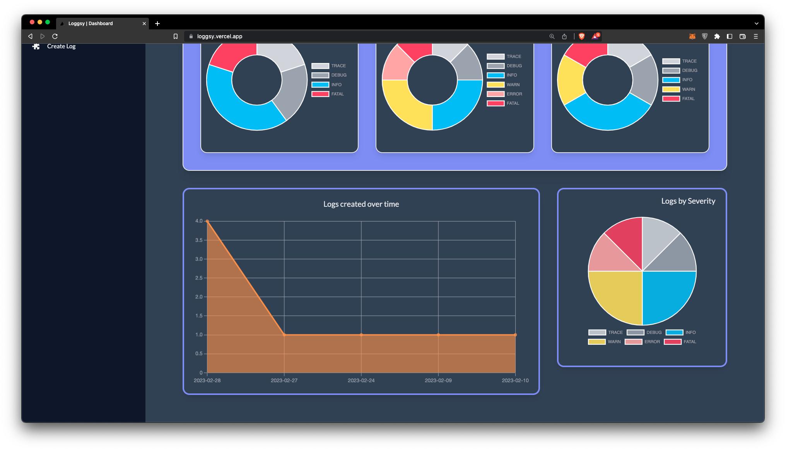
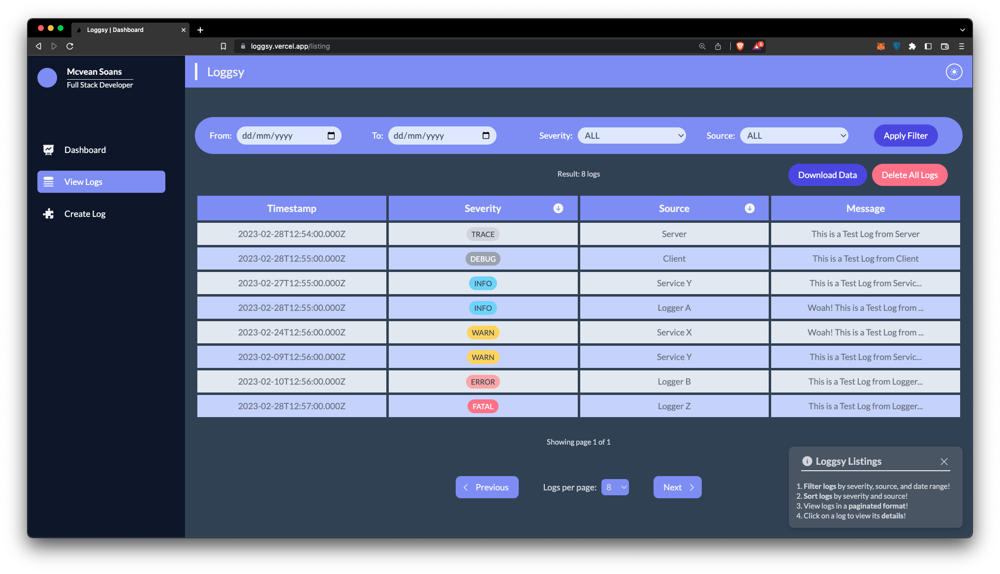
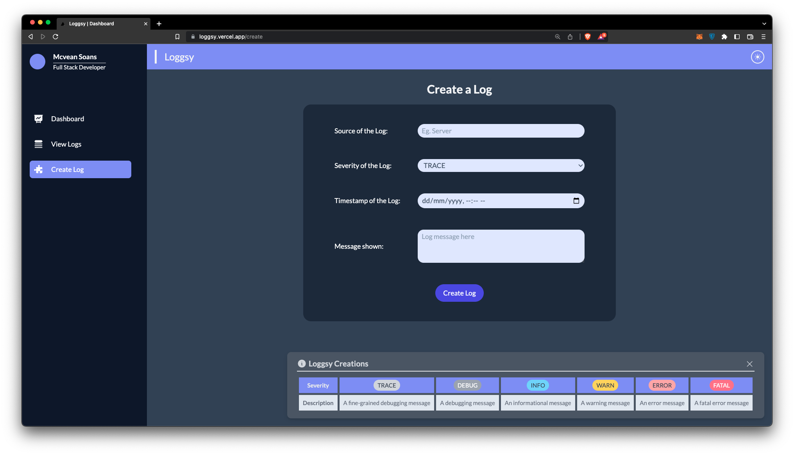

# Loggsy Frontend

### Pages

Dashboard

 

#### Features:

- [x] Visualize aggregated log data
- [x] Dougnut Chart representing logs created today, this week and this month
- [x] Area Chart representing total logs created by date
- [x] Pie Chart representing total logs created by severity

#### Screenshots:

View Logs

 

> The page has informational toast notifications to help improve the UX

#### Features:

- [x] Filter Logs by Date Range, Severity and Source
  - Choose any combination of filters
  - Click on the `Apply Filter` button to apply the filters
- [x] Sort Logs by Severity and Source (Ascending and Descending)
  - Simply click on the arrow icon on the column header to sort by that column
- [x] Client-side Pagination
  - You can change the number of logs per page by clicking on the dropdown menu below the table (default is 8)
  - Click on the `Next` and `Previous` buttons beside the dropdown to navigate to the next or previous page
  - You can see the current page number and total number of pages at the bottom of the table
- [x] Download the logs as a CSV file
  - Click on the `Download Data` button above the table to download the logs as a CSV file
- [x] Click on one of the logs to view the details of that log or even delete it
  - Log ID and Timestamp are kept as unmodifiable fields
  - Source, Severity and Message are modifiable fields
- [x] You can even delete multiple logs at once by clicking on the` Delete All Logs` button

#### Screenshot:

Create Log

 

> The page has informational toast notifications to help improve the UX

#### Features:

- [x] Source field is of type `text`
- [x] Severity field is of type `select` with 6 options (`TRACE`, `DEBUG`, `INFO`, `WARNING`, `ERROR` and `FATAL`)
- [x] Timestamp field is of type `datetime-local`
- [x] Message field is of type `textarea`
- [x] Click on the `Create Log` button to create a new log
  - If the form is valid, then the log will be created and you will be redirected to the `View Logs` page
  - If the form is invalid, then you will see the error messages below the respective fields

#### Screenshot:

